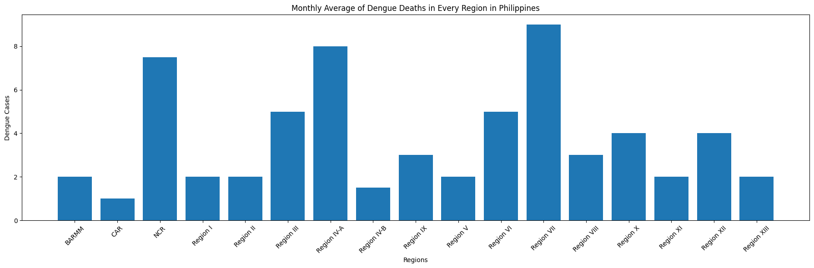

# Dengue Cases in Philippines

## Introduction

Dengue cases are a major health concern in the Philippines. Outbreaks occur every year, with the rainy season typically bringing a surge in infections. Dengue, a mosquito-borne viral infection, can cause a wide range of symptoms, from a mild fever to a severe illness [1].  The Department of Health monitors dengue cases closely and implements various control measures to try and prevent outbreaks.
Dengue poses a particular challenge because there's no specific treatment for the infection itself [2]. The focus is on managing symptoms and preventing complications. Early detection and proper medical care are crucial to a good outcome [3].
Understanding the seasonality and geographical distribution of dengue cases is vital for effective prevention strategies. By pinpointing which months and regions in the Philippines see the most cases, health authorities can target resources and interventions more effectively. This allows for focused mosquito control efforts, public awareness campaigns during peak seasons, and improved preparedness within healthcare facilities in high-risk areas.
This study utilized John Vincent Gupo’s ‘Philippines Dengue Cases 2016-2020’ dataset from Kaggle [4] to conduct an exploratory data analysis (EDA) of dengue cases and dengue deaths across different months and regions in the Philippines from 2016 to 2020. The EDA process involved several steps: data cleaning, descriptive statistics, data visualization, statistical tests, and drawing conclusions. The primary objectives of this EDA were multifaceted.

### Objectives of the EDA: 

1.	To determine which month has the most dengue cases and dengue deaths in average.
2.	To determine which region in Philippines has the most dengue cases and dengue deaths in average.
3.	To determine what year/s the dengue cases and dengue deaths have peaked.
4.	To test if there is a significant difference in the means of dengue cases across different months of the year.

## DATA CLEANING AND PREPARATION

In the data cleaning phase of the exploratory data analysis, we focused on checking for duplicates and missing values. Fortunately, the dataset was found to be free of both duplicates and missing values, ensuring that it was already clean and ready for subsequent analysis without requiring any modifications. Furthermore, we used the ‘describe()’ method on the Data frame to obtain an overview of the basic statistical properties of the dataset, confirming its integrity and reliability for our analysis.

## DATA VISUALIZATION

In the data visualization section of this exploratory data analysis (EDA), various graphical techniques, including bar graphs, heatmaps, and time series graphs, are employed to uncover trends and patterns within the dataset. Bar graphs provide a straightforward comparison of dengue cases and deaths across different months and years. Heatmaps are utilized to identify the years with high dengue cases in every region, offering a detailed visual representation of regional patterns over time. Time series graphs depict the temporal evolution of dengue cases and deaths, allowing for the identification of seasonal patterns and long-term trends. These visualizations allow analysts understand the data's structure and dynamics.

Bar Graph of Dengue Cases:

This bar graph displays the average number of dengue cases in the Philippines for each month from 2016 to 2020. The data reveals that dengue cases peak during the months of August and September, with August showing the highest average count. There is also a noticeable increase in cases starting from June, peaking in August, and then gradually decreasing towards the end of the year. The months of January through May exhibit relatively lower average counts, with a slight rise observed in July. This seasonal trend highlights a significant increase in dengue cases during the rainy season. 

Bar Graph of Dengue Deaths:

This bar graph displays the average number of dengue deaths in the Philippines for each month from 2016 to 2020. The data reveals that dengue deaths peak during the months of September and October, with September showing the highest average count. There is also a noticeable increase in cases starting from July where the dengue cases start to rise, peaking in September, and then gradually decreasing towards the end of the year. Same with dengue cases, the months of January through May exhibit relatively lower average counts, with a slight rise observed in July. This seasonal trend highlights a significant increase in dengue deaths during the rainy season. 

Bar Graph of Dengue Cases in every Region:

This bar graph illustrates the monthly average of dengue cases across various regions in the Philippines. It highlights notable regional differences, with Regions IV-A and III exhibiting the highest averages. Other regions like NCR and Region VII also show elevated averages compared to the rest. The data suggests significant regional variation in dengue cases which may be influenced by factors such as population density and environmental conditions.

Bar Graph of Dengue Deaths in every Region:

This bar graph illustrates the monthly average of dengue deaths across various regions in the Philippines. It highlights notable regional differences, with Regions IV-A and VII exhibiting the highest averages. Other regions like NCR and Region VI also show elevated averages compared to the rest. The data suggests significant regional variation in dengue-related mortality, which may be influenced by factors such as healthcare access and environmental conditions.

Heatmap of Yearly Dengue Cases in every Region:

Heatmap of Yearly Dengue Deaths in every Region:

Time Series Graph of Dengue Cases from 2016 to 2020:

Time Series Graph of Dengue Deaths from 2016 to 2020:

This analysis examines dengue cases and deaths in the Philippines from 2016 to 2020 through heatmaps and time series graphs. The heatmaps show significant regional variations, with Regions IV-A and III having the highest case numbers in 2019, while Regions IV-A and VII recorded the most deaths in 2019 and 2016, respectively. NCR also displayed elevated case and death counts, particularly from 2017 to 2019. Interestingly, Region III, despite high case counts, did not show correspondingly high mortality, indicating regional disparities and potential hotspots.

The time series graphs further illustrate these trends, showing a decline in mean dengue cases and deaths from 2016 to 2017, followed by a gradual increase, peaking sharply in 2019. A significant decrease in both cases and deaths is observed in 2020, highlighting variability over the years. These visualizations underscore the need for targeted public health interventions in identified hotspots.

## STATISTICAL ANALYSIS

In the statistical analysis section of this exploratory data analysis (EDA), a one-way ANOVA test was conducted to compare the average number of dengue cases across different months. This test helps determine if there are statistically significant differences in dengue cases between months.

Null Hypothesis (H0): There is no significant difference in the average number of dengue cases across different months.
Alternative Hypothesis (H1): There is a significant difference in the average number of dengue cases across different months.

One-way ANOVA results.

| Test Statistic (F)  |         P-value         |
| --------------------| ------------------------|
|       12.56         |      1.69×10^−22        | 

The results of the one-way ANOVA test reveal a test statistic of 12.561 and a p-value of approximately 1.69×10^−22. This extremely low p-value indicates that the differences in the average number of dengue cases across the months are statistically significant. Therefore, we reject the null hypothesis and accept the alternative hypothesis, concluding that the average number of dengue cases varies significantly between months.

This finding suggests that dengue cases are not uniformly distributed throughout the year and that certain months experience higher incidences of dengue. This aligns with the observed seasonal trends, highlighting the importance of targeted interventions during peak months to mitigate the spread of dengue.

## CONCLUSION

The exploratory data analysis (EDA) of dengue cases and deaths in the Philippines from 2016 to 2020 revealed critical insights. Key objectives were to identify the months and regions with the most dengue cases and deaths, pinpoint peak years, and test for significant differences in monthly case averages. The analysis found that August had the highest average number of cases. Regions IV-A and III had the highest average cases, while Regions IV-A and VII recorded the most deaths in 2019 and 2016, respectively. The time series showed peaks in 2019 for both cases and deaths, with a significant drop in 2020. The one-way ANOVA test indicated significant differences in dengue cases across months.

The findings highlighted notable regional and temporal variations, underscoring the importance of targeted public health interventions. The skewed distributions, with means significantly higher than medians, pointed to outliers and a few months with exceptionally high counts. The visualizations, including bar graphs and heatmaps, effectively illustrated these trends, emphasizing the need for focused efforts during peak months and in regions identified as hotspots.

Based on these findings, it is recommended to include enhancing mosquito control measures and public awareness campaigns, particularly in high-risk regions and during peak months like July and August. Strengthening healthcare infrastructure could also aid in timely intervention and management of dengue outbreaks.

Limitations of the study include reliance on reported data, which may underrepresent actual dengue cases due to underreporting or misdiagnosis. The retrospective dataset from 2016 to 2020 restricted real-time analysis and the consideration of all confounding variables. Moreover, the timeframe constraint may overlook recent trends or long-term changes. Future research should incorporate broader and more current data sources to bolster the study's reliability and relevance.

### REFERENCES

[1] https://www.who.int/bangladesh/news/detail/28-05-2018-dengue-a-mosquito-borne-disease

[2] https://www.mayoclinic.org/diseases-conditions/dengue-fever/diagnosis-treatment/drc-20353084

[3] https://www.mdpi.com/2414-6366/8/4/188

[4] https://www.kaggle.com/datasets/vincentgupo/dengue-cases-in-the-philippines/code
